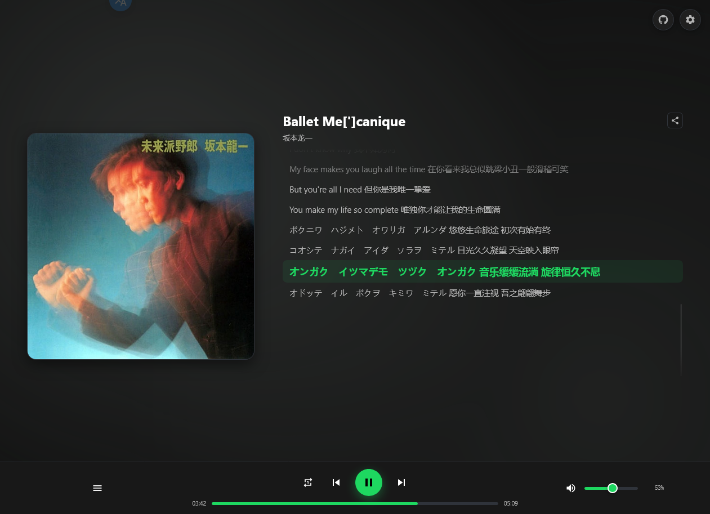
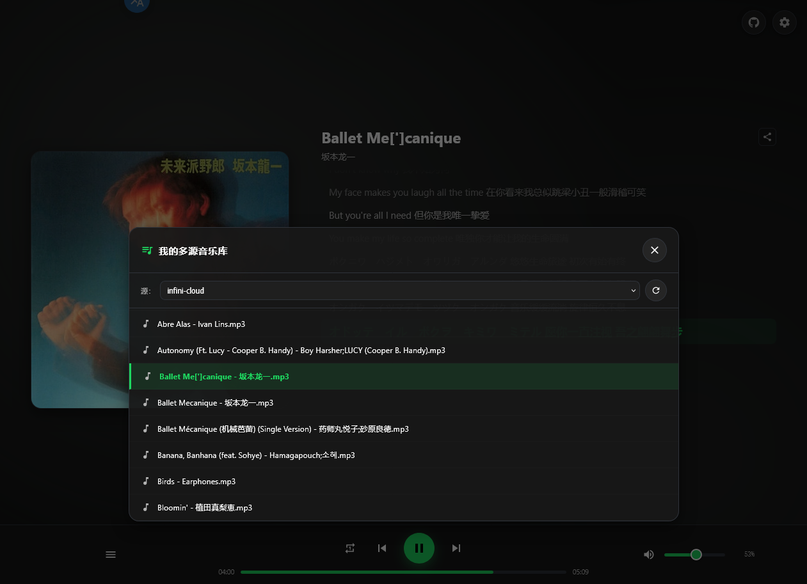

# webdav_music_player
一个基于 CF Workers 的简单浏览器音乐播放器。

## 灵感与参考

- **灵感源自 diffuse** —— [icidasset/diffuse](https://github.com/icidasset/diffuse)
- 页面与交互参考自 [TheSamoanThor/test-frontend-music-app](https://github.com/TheSamoanThor/test-frontend-music-app)。

## 功能特性

- **单文件部署**：部署只需要 `worker.js` 一个文件，前后端全部逻辑都在里面，绑定一个 KV 命名空间即可运行。`worker.js` 是构建产物，由 `src/*.part.js` 逐字节拼接生成，改动请落 `src/` 而不是直接编辑它（见下文"源码结构与构建"）。
- **多 WebDAV 源**：可视化管理多个 WebDAV 源（别名 / 地址 / 账号 / 密码），可按源切换或“全部合并”并按歌名自动去重；同名歌曲在多源间自动组成镜像线路，播放失败时自动切换下一线路。
- **标签全部来自文件本身**：通过 jsmediatags 直接解析音频内嵌标签，封面、歌名、艺术家、歌词均读取自音频文件，**不从任何网络接口抓取元数据**。
- **音频流代理**：Worker 代理 WebDAV 音频流，支持 Range 拖动进度，浏览器直接播放，不向浏览器暴露网盘账号密码。
- **KV 高速缓存**：曲目列表缓存 30 分钟，访客只读缓存以保护网盘；管理员可强制穿透刷新（30 秒冷却）。
- **8 位极短分享链接**：每首歌生成 `?play=xxxxxxxx` 短链，可直接分享直达播放。
- **播放能力**：列表循环 / 单曲循环 / 随机播放、进度条拖动、音量滑块 + 滚轮微调（Chrome / Firefox / WebKit 内核兼容，记忆音量）、内嵌 LRC 歌词逐行高亮滚动（手动翻阅自动暂停跟随，可一键回到当前进度，点击歌词行跳转播放）。
- **故障诊断**：WebDAV 出错时给出中文诊断报告（401 / 403 / 404 / 405、网盘 WAF 频控、误填管理页网址等）；控制台仅显示源名与状态摘要，完整诊断详情（含目标地址与原始报文）仅管理员在页内“诊断详情”弹窗可见。
- **MD3 风格 UI**：Material Design 3 风格图标与暗色配色，右上角 GitHub 徽标入口，站点标题可自定义。

---


---


## 已知限制

> 这是一个规模很小的个人项目，偏向于分享某个月某个时间段积累的歌单，使用前请知悉以下边界：

- **仅在 `Koofr` 与 `infini-cloud` 的公共 WebDAV 上测试过**，其他 WebDAV 服务未经验证。
- **曲库规模只有数百首**，按此量级设计并测试，更大曲库未做验证。
- **不支持搜索**。
- **不支持嵌套查询文件夹**：只扫描每个 WebDAV 源配置目录的根目录文件（`PROPFIND Depth:1`），子目录中的歌曲不会被收录。
- 封面、歌词、艺术家、歌名等标签完全依赖音频文件自身的内嵌标签：文件没写标签时将显示文件名 / 未知艺术家 / 暂无歌词。

## 支持的音频格式

`.mp3` `.flac` `.m4a` `.ogg` `.wav` `.aac` `.ape` `.alac` `.opus` `.wma` `.dsd` `.dsf` `.dff` `.mka`

## 源码结构与构建

仓库按"可回归测试的切片源 → 逐字节拼接 → 单文件产物"组织：

```
src/01-handler.part.js      # 七片 = worker.js 的连续字节切片，按文件名顺序拼接即还原
src/02-share.part.js        # 分享链接与 HTML 转义
src/03-text.part.js         # track id / XML 实体 / 歌名归一
src/04-diagnostic.part.js   # WebDAV 故障中文诊断
src/05-auth.part.js         # 口令哈希、源 URL 校验、会话与 Cookie
src/06-webdav.part.js       # 路径收敛、URL 解析、PROPFIND 列表
src/07-render.part.js       # 页面模板区（renderHTML）在这一片里
golden/worker.head.mjs      # worker.js 的逐字节冻结副本，不依赖 git 的比对锚（.mjs 后缀便于被 import）
build.mjs                   # 纯 node 拼接器 + 字节相等棘轮
runtime-lock.mjs            # 运行时版本锁，读取 .node-version
test/                       # 零依赖回归测试（node:test + node:assert）
build/out/worker.check.mjs  # 构建时生成的校验副本
worker.js                   # 构建产物 = 唯一部署件
```

- `worker.js` 由 `build.mjs` 按文件名顺序拼接 `src/*.part.js` 生成，与仓库内的 `worker.js` 逐字节一致；日常改动请改 `src/`，不要直接编辑 `worker.js`。
- **字节相等棘轮**：`build.mjs` 先把拼接结果与 `git show HEAD:worker.js` 比对，任何一字节差异（含丢换行、CRLF 漂移）都会立即报错退出、不写产物。切片切错一行、顺手改了一个字符都会被抓到。若改动是有意的，需在同一提交里同步更新 `golden/worker.head.mjs` 并重录相关 golden。
- **基准是 `HEAD` 里的内容，与提交哈希无关**：`commit --amend`、撤销后重新提交、rebase 都不会弄红它。会红的只有一种情况——`HEAD` 里的 `worker.js` 落后于磁盘上的 `src/`（例如撤销了一个改过 `worker.js` 的提交），按上一条更新 golden 即可。红的时候构建器在写文件之前就退出，不会改动你的任何文件。
- **零依赖**：无 `package.json`、无 npm 依赖、无打包器；构建与测试只用 Node 自带的 `node:fs` / `node:test` / `node:assert`。
- **运行时版本锁**：`runtime-lock.mjs` 只锁 Node **主版本**——当前运行时的 major 与 `.node-version` 记录的 baseline major 一致即放行（同一主版本内的任意 minor / patch 都能构建与测试），跨主版本才抛错并给出迁移三步；`.nvmrc` 给出精确 baseline，`nvm use` 可一步对齐。

### 构建

前置：Node 主版本与 `.node-version` 一致（同主版本的任意 minor / patch 均可）；仓库内有 `git`（棘轮基准取 `git show HEAD:worker.js`）。

```bash
node build.mjs
```

通过时输出两行：`build: node <当前版本> (major-locked <主版本>, baseline <.node-version>)` 与一行含 **`byte-equal HEAD`** 的成功摘要。判定只看 **`byte-equal HEAD`** 是否出现（片数与字节数随源码变化，不按整行断言）；红的时候退出码非 0，并打印首个差异字节偏移与差异点前后文。

### 回归测试

集成层会 `import` 构建产物 `build/out/worker.check.mjs`，因此**必须先构建、再测试**：

```bash
node build.mjs
node --test "test/*.test.mjs"
```

四层门：

| 层 | 文件 | 覆盖 |
|---|---|---|
| Tier-1 单元 | `test/01-unit.test.mjs` | 纯函数：HTML 转义、track id、歌名/歌词归一、源 URL 校验、会话、诊断分支表 |
| Tier-2 集成 | `test/02-handler.test.mjs` | 全路由 handler（打桩 `fetch` + 内存 KV + 真实 WebCrypto + 冻结时钟） |
| Tier-3 快照 | `test/03-render-snapshot.test.mjs` | `renderHTML` 长度 / SHA-256 / 结构锚点 |
| Tier-4 对拍 | `test/00-build-parity.test.mjs` | 切片拼接 vs `HEAD` vs `golden` vs 构建产物 vs 工作区 `worker.js` 的字节与语义一致性 |

全绿判据：末行 TAP 汇总为 `# fail 0`。

## 部署

1. 在 Cloudflare Dashboard 创建一个 Worker。
2. 创建一个 KV 命名空间，并在 Worker 设置中将其绑定为变量 **`MUSIC_KV`**（变量名大小写必须完全一致，否则启动即提示 500 错误）。
3. 将 `worker.js` 全部内容粘贴进 Worker 并部署。
4. 打开 Worker 页面，首次访问会弹出初始化窗口：设置站点标题与管理员密码（密码同时作为 Cookie 登录凭证，30 天免密）。
5. 进入“设置” → 添加 WebDAV 源（别名、WebDAV 地址、账号、密码）→ 保存更改。没有测试过免登录的WebDAV源。
6. 管理面板支持将源配置导出为 JSON 备份，也可从 JSON 导入并按 URL 自动合并更新，这也意味着目前同一个地址只会更新里面的账号鉴权信息，不会因为这是另外一个账号就新开一个源。此外支持"复制口令 / 粘贴口令"：用单行 `WMP1.` 加密文本在两份部署之间直接转移源配置——口令只与导出时设置的加密口令绑定（与登录密码无关），口令文本本质是在转移账号凭据，请只发给可信的人。

## 使用说明

- 访客只能读取 KV 缓存的曲目列表；管理员点击刷新按钮会实时穿透同步 WebDAV。

## License

[MIT](LICENSE)
